# Introduction
Here I will be looking at the census income data available at https://archive.ics.uci.edu/ml/datasets/Census+Income with the aim of predicting whether a person earns more than 50k or less than. I retrieved the data from Kaggle at https://www.kaggle.com/uciml/adult-census-income where it was already in a csv file with the correct column headers.

**Reference**: Dua, D. and Graff, C. (2019). UCI Machine Learning Repository [http://archive.ics.uci.edu/ml]. Irvine, CA: University of California, School of Information and Computer Science.

## Procedure
I will follow the following procedure to achieve the task of predicting whether salary is less than or greater than 50k:
1. Dataset description
2. Data Wrangling
3. Exploratory Data analysis
4. Multiple model development
    - Logistic Regression
    - Stochastic Gradient Descent
    - Decision Trees 
    - Random Forests
    - KNN
5. Model Evaluation and Refinement
6. Conclusion.

## Dataset Description
- age: The age of the person
- workclass: The working class eg self-employed, private, government-employed etc
- fnlwgt: The final weight. 'The weights on the Current Population Survey (CPS) files are controlled to independent estimates of the civilian noninstitutional population of the US' (Kaggle, https://www.kaggle.com/uciml/adult-census-income)
- education: Level of education eg Bachelors, doctorate etc.
- education-num: Number of years of education
- marital-status: Whether married or single or divorced etc.
- occupation: Type of work at eg. Tech-support, Craft-repair etc.
- relationship: The relationship to the people in the household eg wife, only-child, unmarried.
- race: The race of the person eg White, Other, Black etc.
- sex: Whether male or female
- capital-gain: The amount of capital gained
- capital-loss: The amount of capital lost
- hours-per-week: How many hours worked per week
- native-country: The original country/ home country

### Load the necessary libraries 


```python
#import the necessary modules/libraries
import pandas as pd
import numpy as np
import matplotlib.pyplot as plt
import matplotlib as mpl
import seaborn as sns
#%matplotlib inline

from sklearn.ensemble import RandomForestClassifier
from sklearn.linear_model import LogisticRegression, SGDClassifier
from sklearn.neighbors import KNeighborsClassifier
from sklearn.tree import DecisionTreeClassifier
from sklearn.model_selection import GridSearchCV, cross_val_score, learning_curve, train_test_split, KFold
from sklearn.metrics import classification_report, confusion_matrix, accuracy_score
from sklearn.ensemble import GradientBoostingClassifier
```

### Load the data


## Data Wrangling


get summary statistics of the whole dataset

All data types are correct so proceed to check for missing values 


The results above imply that there are no missing values. However, by looking at the first 5 rows, we can see there row entries with question marks. There, replace these question marks with "NaN" and then check how many rows have missing values.


Since the number of rows that have missing values are not that many compared to the size of the dataset we drop the missing values. Additionally, since they are categorical variables, there is no median value we can replace them with and using the frequency may bias the results.


We need to format the column we intend to predict to binary 0 and 1 where 0 represents $\leq 50$k and 1 represents $>50$k


## Exploratory Data Analysis
### Numerical data
Explore the relationship between the numerical data and the target variable<br>
It is important to understand the distribution of the people's earning that is what percentage of the dataset earns more than 50k and what percentage earns less. This will help us identify class imbalance to understand the impact it may have on the models.


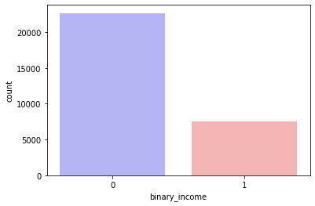


    

**Correlation matrix for numerical data**<br>
Plot a correlation matrix to see how the numerical variables are correlated with one another


The income seems to be most correlated with number of education years but even the pearson's r is very low. It is also correlated positively with age, capital gain, hours per week, and capital loss in that order. It is inversely correlated with final weight but the correlation is very small.

**Scatter Plots for all numerical variables**<br>
The scatter shows how the variables are related with each other in relation to the income. 


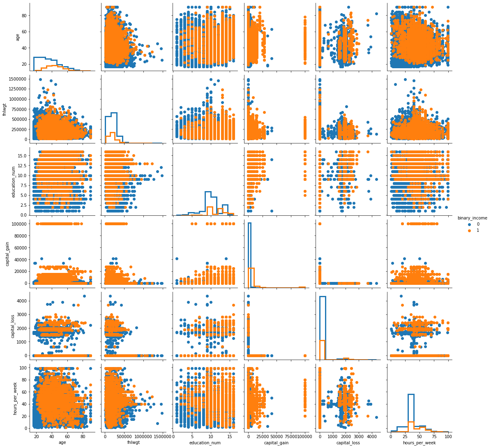


The blue markers indicate the people who earn less than 50k while the orange markers indicate the people who earn more than 50k. It is clear that a simple linear regression cannot be used to make predictions and that this is a classification problems. 

### Categorical data
We want to see the Percentage distribution of the categorical variables in relation to the income


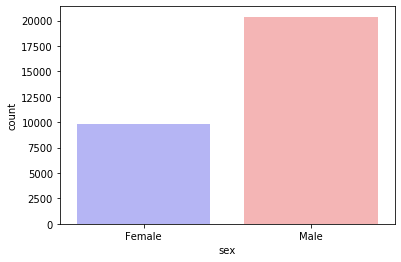


    

The dataset contains 2/3 males and 1/3 females


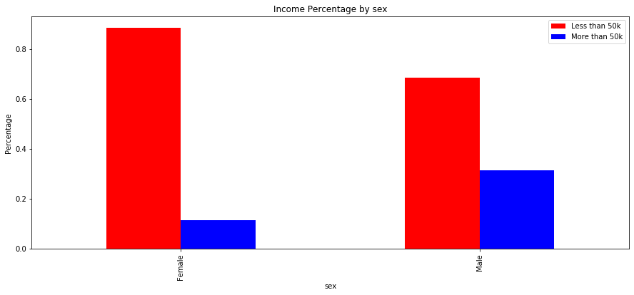


This shows that there are more females than men who earn less than 50k and more males than females who earn more than 50k and overall, there are more people who earn less than 50k. The proportions for the sex are varying which indicates that country may be an important predictor. 


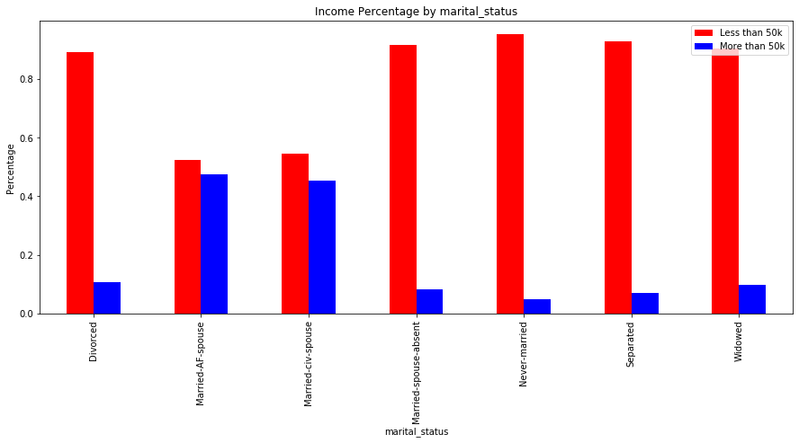


This shows that more people who were married with the spouse present earned more than 50k. The other categories (divorced, married-spouse-absetn, never-married, separated, widowed) can be termed as single and most of these people earned less than 50k. Overall the proportions for the rmarital status are varying which indicates that country may be an important predictor. 


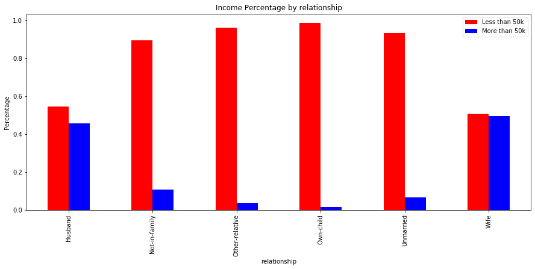


This result shows that there are more husbands and wives in a household who earn more than 50k while there are more people from other categories who earn less than 50k. Overall the proportions for the relationship are varying which indicates that country may be an important predictor. 


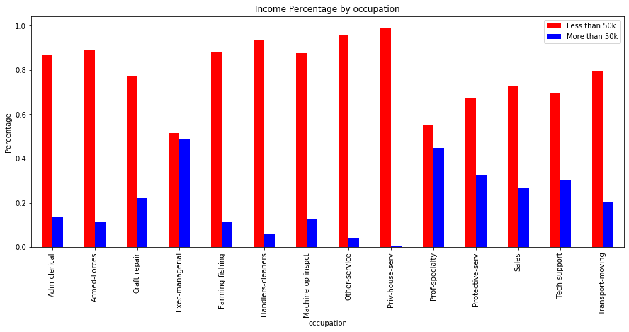


This shows that Executive-managerial and prof-speciality have the highest proportions of people earning more than 50k while Other-service, Private-house-service and handlers-cleaners have the highest proportions of people earning less than 50k. Overall the proportion for the occupation is varying which indicates that country may be an important predictor. 


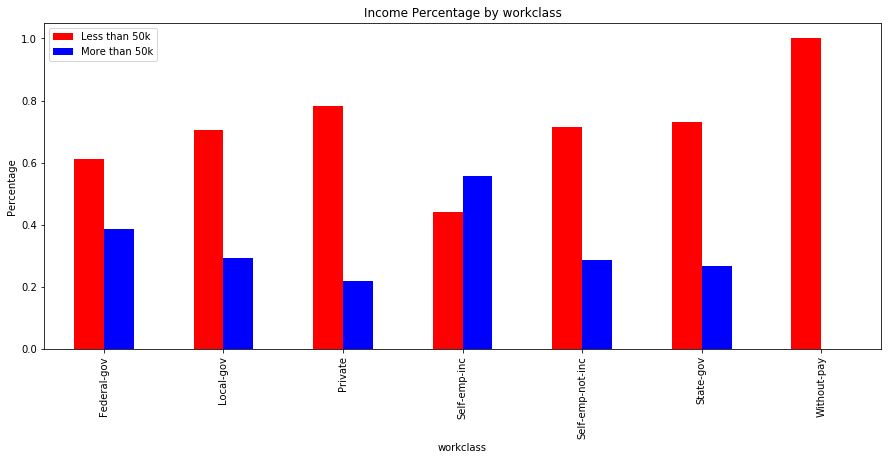


This shows that self-employed people have the highest proportion of people earnign more than 50k while those without pay will obviously fall below 50k and thus have the highest proportion for less than 50k. Overall the proportion for the working class is varying which indicates that country may be an important predictor. 


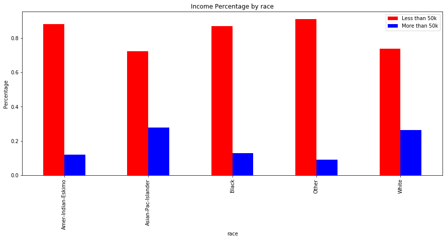


This shows that Asian-Pacific-islander race has the highest proportion of people earning more than 50k and other has the highest proportion of people who earn less than 50k. Overall there is not much difference in the proportions of people earning more than 50k which indicates race may not be an important predictor.  


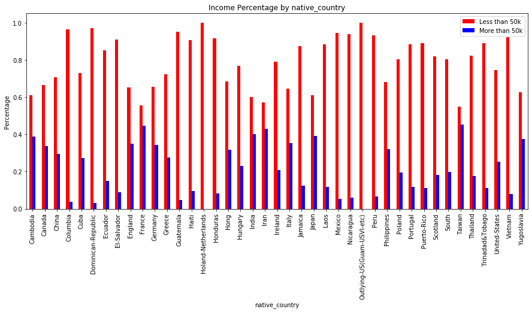


The proportion per country is varying which indicates that country is an influenctial predictor. 


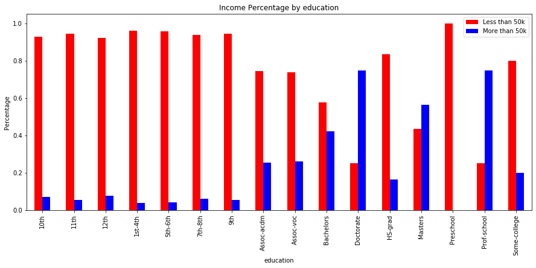


This shows that those who have a doctorate and prof-school have the highest proportion of people who earn more than 50k while those who went just upto 12th grade (1st - 12th) have the highest proportions of people who earn less than 50k

## Model Development
Here, I will build several models and then evaluate the models using confusion matrix.<br>
Before building the models, it is important to convert all categorical variables to numeric without them being ordinal that is there should be no hierarchy within a column. For example, there is no good reason why doctorate should be assigned 1 and 12th 4 etc. Therefore, I use Onehot encoding which ensures that each variable is treated equally.

### Feature Scaling
Here, I convert the categorical variables into numeric using onehot encoding as stated above. I use feature scaling to standardize the continuous variables. In this case, standardization feature scaling is applied where the mean is removed and then divides the variables by the standard deviations so that we have unit variance.


#### Pipelines
Pipelines are very useful in simplifying steps to transforming data. They help in sequentially performing multiple transformations on given datasets. Here, I use pipelines to standardize the continuous variables and then to simultaneously encode the categorical variables and merge this into one sparse matrix. The matrix is then converted to a pandas dataframe to be used in training models.


Split the data into training and testing data with the testing size being 30%


### Logistic Regression.
I start with logistic regression with all the features and calculate the accuracy score.

Accuracy score for logistic regression: 84.8160
    

### Stochastic Gradient Descent

Accuracy score for SDG classifier: 83.9319
    

### Decision Trees


Accuracy score for decision tree classifier: 81.1250
    

### Random Forests

 Accuracy score for random forest classifier: 84.7386
    

### KNN Neighbours


Accuracy score for knn neighbours classifier: 83.3904
    


```python
print("Highest accuracy score for knn neighbours classifier: {0:0.4f}" .format(100*max(scores)))
```

    Highest accuracy score for knn neighbours classifier: 83.6778
    

## Model Evaluation and Refinement
The accuracy scores attained by the models are quite with logistic regression performing best. I go on to see if I can improve the accuracy score using cross-validation whose aim is to select the model that best represents the real world. Cross-validation splits the data into k folds and then trains the model with k-1 folds and tests with the remaining 1 fold. This process is repeated until all folds have been used as testing/validation set which in turn reduces the testing error and overfitting.


    KFold CrossValScore for knn neighbours 0.8371145281569843
    

From the cross-validation results, the simple logistic regression has the highest accuracy and may be enough to predict whether a person earns more than or less than 50k. 
### Confusion Matrix
A confusion matrix shows how well the model performed in classifying the variables in their correct category.


